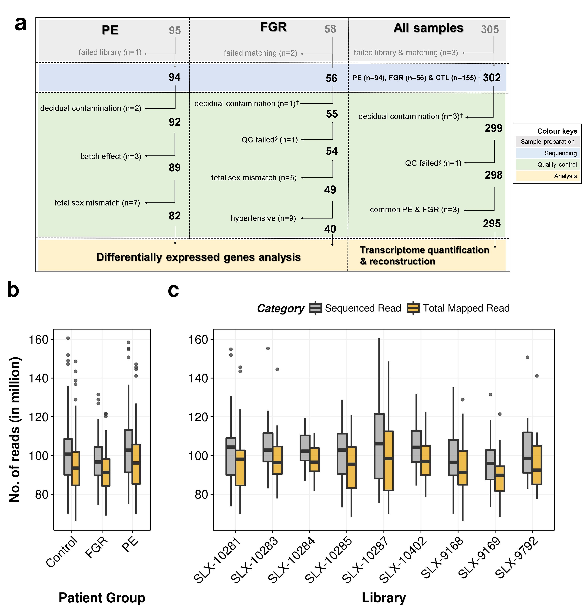
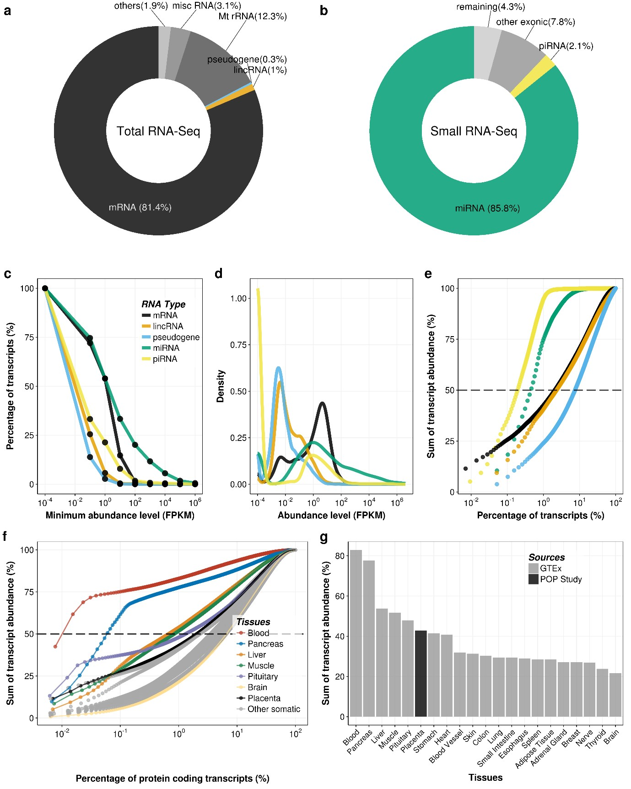
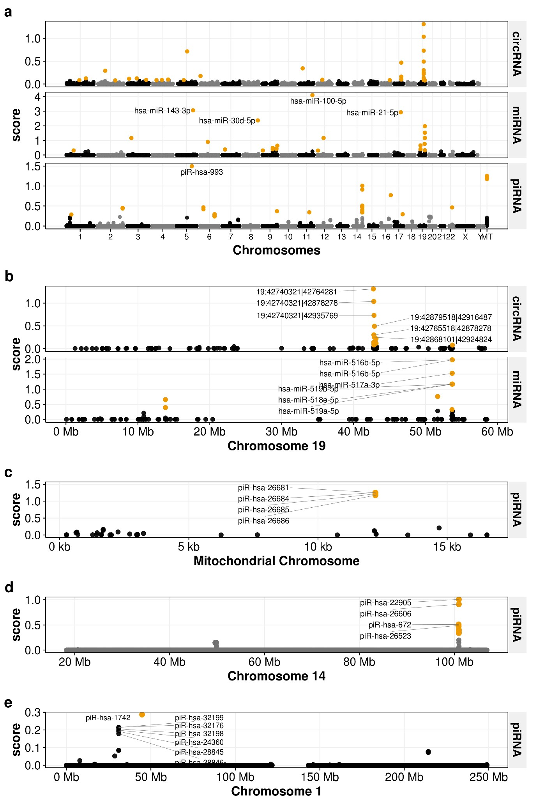
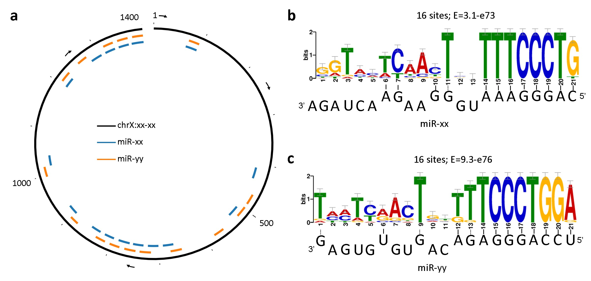

---
#---POSTER SIZE & DEFAULT FONT---#
#poster_height: "33.1in" # height in inches of poster
poster_height: "34in" # height in inches of poster
poster_width: "46.8in" # width in inches of poster
title: The RNA landscape of the human placenta in health and disease 
author:
  - name: Sungsam Gong
    affil: 1
    orcid: '0000-0001-5796-4423'
  - name: Francesca Gaccioli
    affil: 1 
  - name: Justyna Dopierala
    affil: 1
  - name: Ulla Sovio 
    affil: 1
  - name: Gordon Smith 
    affil: 1
  - name: D Stephen Charnock-Jones 
    affil: 1
affiliation:
  - num: 1
    address: Department of Obstetrics and Gynaecology, University of Cambridge</br>NIHR Cambridge Biomedical Research Centre, Cambridge, United Kingdom 
#logoright_name: https&#58;//raw.githubusercontent.com/brentthorne/posterdown/master/images/betterhexlogo.png
#logoleft_name: https&#58;//raw.githubusercontent.com/brentthorne/posterdown/master/images/betterhexlogo.png
logoleft_name: 'Figures/Cambridge/Black and white logo/Screen and web/Black and white RGB_DM.png'
logoright_name: 'Figures/NIHR/Cambridge-Biomedical-Research-Centre_logo_outlined_RGB_BLACK-2.png' 
#STYLE & FORMATTING
primary_colour: "#91B9A4" # cambridge blue
secondary_colour: "#91B9A4" # cambridge blue
#titlebox_bgcol: "#a82248"  #Colour of the Title Box background - does not work (use secondary)
#titlebox_bordercol: "#0b4545" #Colour of the title Box border. - does not work (
titlebox_shape: "" #ONLY posterdown_PDF
titlebox_borderwidth: "1cm"
titletext_fontfamily: Helvetica
title_textcol: "#ffffff" #colour of title text
author_textcol: "#ffffff" # Colour of author text
affiliation_textcol: "#FFFFFF" # Colour of affiliation text
title_textsize: "80pt"         # Poster title fontsize
author_textsize: "43pt"       # Author list font size
#---POSTER BODY OPTIONS---#
body_bgcol: "#ffffff" #colour of the poster main background
sectitle_textsize: "50pt" # h1
body_textsize: "45px"    # Size of the main poster body text
body_textcol: "#000000" # Colour of main text in the body of poster
column_numbers: 4 # Number of columns that the poster has
column_margins: "0.5in" # Margin spacing for columns
columnline_col: "#008080" #colour 
columnline_width: "1mm" #width of line between each column
columnline_style: dashed #style of the column line seperator.
#SECTION TITLE STYLING
sectitle_textcol: "#ffffff" # Colour of the poster section titles
sectitle_bgcol: "#91B9A4" # Colour of the section title box
sectitle_bordercol: "#0b4545" # Colour of the border around the section title box.
sectitle_borderwidth: "2mm" # Thicknes of the section title box border
sectitle_boxshape: "4mm 0mm" # Changes the shape of the section title box.
sectitle2_textcol: "#0b4545" # Color of 2nd level header text.
#--OTHER--#
link_col: "#0b4545" #colour of other links within the poster

output: 
  posterdown::posterdown_html:
    self_contained: false
    pandoc_args: --mathjax
    highlight: tango
    number_sections: false
bibliography: myRef.bib
---

<style>
.logo_left{
width: 15%
}
.logo_right{
width: 15%
}
.poster_title {
width: 70%
}
img{
    margin-top: .9cm
}
</style>

```{r setup, include=FALSE}
knitr::opts_chunk$set(echo = FALSE)
```

# Introduction
## Motivations
1. Placental dysfunction underlies a large proportion of maternal and perinatal morbidity and mortality, which is a half the total burden due to cancer.
2. The placental tissues are under-represented (or none) in multi-omics projects (e.g. GTEx; RoadMap).
3. Publicly available placenta transcrptome data lack the depth of coverage and the sample number.

# Materials & Methods 
1. 302 placental biopsies of the POP Study cohort[@PMID:19019223;@PMID:26360240;@PMCID:PMC5701771], of which 94 and 56 are from cases of preeclampsia (PE) and fetal growth restriction (FGR).
2. 324 total RNA-Seq datasets (~102 million reads per sample) 
3. 328 small RNA-Seq datasets (~20 million per sample)
4. TopHat2, StringTie and Cuffcompare

```{r fig1-sample, out.width="87%", fig.align='center', fig.cap="Number of placental biopsies and sequencing reads"}

```

# Results

## 1. Relative abundance and complexity of long and short RNAs in the placenta 
```{r fig2-complexity, out.width="88%", fig.align='center', fig.cap='Complexity of RNA transcripts in the placenta'}

```

## 2. Genes expressed specifically in the placenta
```{r placenta-specific, out.width="87%", fig.align='center', fig.cap='Abundance level of genes expressed specifically in the placenta (a: protein-coding, b: lincRNA)'}
knitr::include_graphics('Figures/placenta_specific.jpg')
```

## 3. Highly abundant circular RNAs and short RNAs 
```{r fig3-manhattan, out.width="90%", fig.align='center', fig.cap='Manhattan plots showing relative abundance of short RNAs'}

```

## 4. A putative miRNA sponge 
```{r fig4-circRNA, out.width="100%", fig.align='center', fig.cap='A putative miRNA sponge and its targets miRNAs (sorry, data at non-disclosure stage)'}

```

## 5. Size distribution of placental small RNAs  
```{r fig5-smallRNA, out.width="73%", fig.align='center', fig.cap='Size distribution of placental small RNAs. (‘Mapped reads’: mapped at least 10x, ‘-miRNA’: ‘Mapped reads’ minus miRNA, ‘-miRNA-piRNA-exon’: ‘Mapped reads’ minus miRNA, piRNAs and exon)'}
knitr::include_graphics('Figures/smallRNA_size.jpg')
```

# Conclusions
1. More than 300 well phenotyped placentas sequenced to high depth.  
2. High quality data with strand-specific total-RNA (not poly-A+ selected).
3. Circular RNAs were characterised in the placenta.

# Data availability
* Manuscript in submission
* https://sung.github.io/Placenta_Transcriptome_GI2019 (this poster)
* https://www.obgyn.cam.ac.uk/placentome (will be open to public soon)
* https://www.ebi.ac.uk/ega/studies/EGAS00001002205

# References
